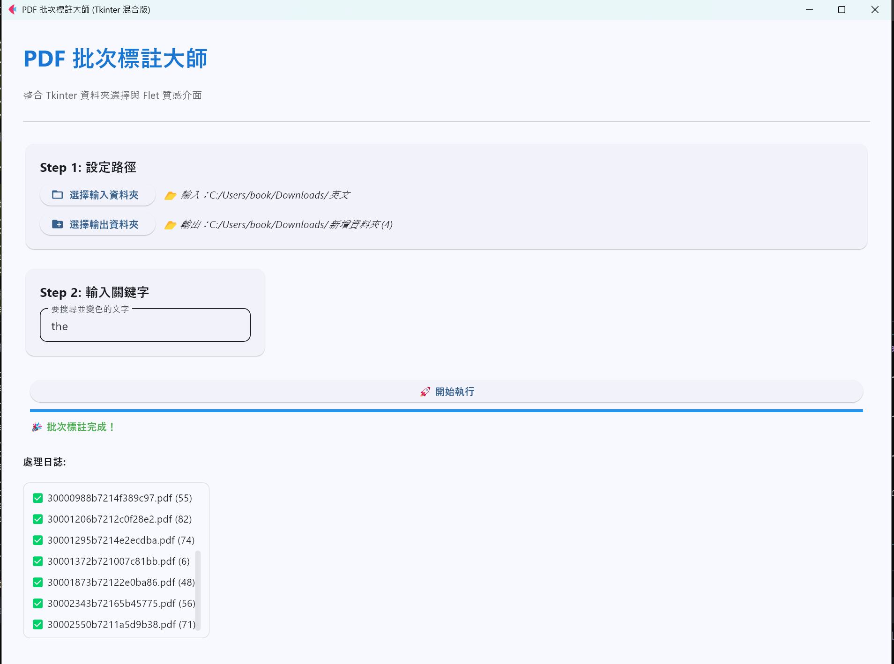
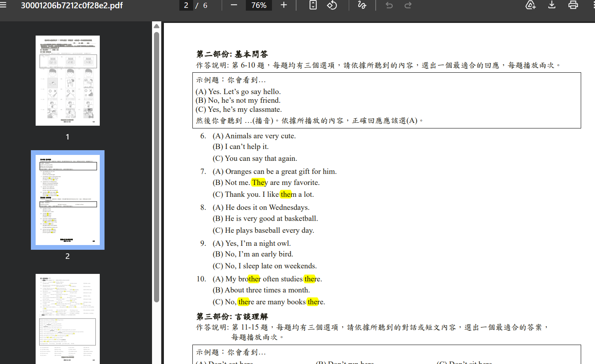

# PDF 自動標註工具 (PDF Marker Tool)

這是一個基於 Python 開發的工具，能夠將 PDF 檔案匯入後，針對指定的關鍵字自動進行螢光筆標註（Highlight）。

## 主要功能
- **檔案選取**：使用系統對話框選取 PDF 檔案。
- **關鍵字搜尋**：自動搜尋 PDF 中所有符合的關鍵字。
- **螢光筆標註**：在搜尋到的位置自動加上黃色螢光筆標記。
- **無損儲存**：另存新檔，不影響原檔案，並優化輸出的 PDF 大小。

### 介面展示


## 核心技術
- **[PyMuPDF (fitz)](https://pymupdf.readthedocs.io/)**: 高效能的 PDF 解析與標註庫。
- **Tkinter**: 用於檔案選取與輸入框的 GUI 介面。

## 安裝與使用

1. **建立虛擬環境並安裝依賴**：
   ```bash
   python -m venv venv
   source venv/bin/activate  # Windows: venv\Scripts\activate
   pip install pymupdf
   ```

2. **執行工具**：
   ```bash
   python pdf_marker.py
   ```

3. **操作流程**：
   - 執行程式後，會彈出視窗請你選擇一個 PDF。
   - 接著會彈出輸入框請你輸入要標註的文字。
   - 程式會自動在同一資料夾下生成 `原檔名_highlighted.pdf`。

## 注意事項
- 僅支援文字類型的 PDF（若是掃描圖片製作的 PDF，需先經過 OCR 處理）。
- 如果關鍵字分散在多行，標註會自動適應每一行的位置。

### 標註效果展示

